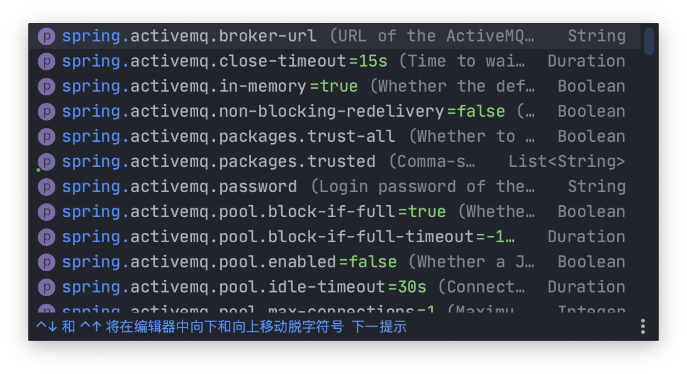

> Spring Boot可以自动装配我们所需要的对象，做到开箱即用，在其启动过程中会经过一系列的操作，完成所需对象的加载，并供我们使用，这些对象是怎么加载的，Spring Boot又是怎么管理他们的？

## 查看依赖项目

发现除了已经选择的`Starter`，其他东西没几个，但是项目有一个父项目

```xml
<parent>
    <groupId>org.springframework.boot</groupId>
    <artifactId>spring-boot-starter-parent</artifactId>
    <version>2.4.3</version>
    <relativePath/> <!-- lookup parent from repository -->
</parent>

<dependencies>
    <dependency>
        <groupId>org.springframework.boot</groupId>
        <artifactId>spring-boot-starter-web</artifactId>
    </dependency>
    <dependency>
        <groupId>org.springframework.boot</groupId>
        <artifactId>spring-boot-configuration-processor</artifactId>
        <optional>true</optional>
    </dependency>
    <dependency>
        <groupId>org.springframework.boot</groupId>
        <artifactId>spring-boot-starter-test</artifactId>
        <scope>test</scope>
    </dependency>
</dependencies>
```

### 父项目

父项目中主要提供的是对资源的过滤规则，以及一个关于`maven`的插件依赖，还有一些版本管理的插件等，此外它也有一个父项目

```xml
<parent>
  <groupId>org.springframework.boot</groupId>
  <artifactId>spring-boot-dependencies</artifactId>
  <version>2.4.3</version>
</parent>
```

看名字就知道了，是Spring Boot的依赖项目

### 父项目的父项目

这个项目里包含了Spring Boot能管理的所有依赖以及插件的信息，但是创建一个项目时，这些依赖可不是全都加载到项目中，不然我们的项目得多臃肿啊！

看来还有其他的机制来配合共同完成依赖的加载，继续看

```xml
<!-- 截取了一部分 -->
<properties>
    <activemq.version>5.16.1</activemq.version>
    <antlr2.version>2.7.7</antlr2.version>
    <appengine-sdk.version>1.9.86</appengine-sdk.version>
    <artemis.version>2.15.0</artemis.version>
    <aspectj.version>1.9.6</aspectj.version>
    <assertj.version>3.18.1</assertj.version>
    <atomikos.version>4.0.6</atomikos.version>
    <awaitility.version>4.0.3</awaitility.version>
    <bitronix.version>2.1.4</bitronix.version>
    <build-helper-maven-plugin.version>3.2.0</build-helper-maven-plugin.version>
    <byte-buddy.version>1.10.20</byte-buddy.version>
</properties>

<dependencyManagement>
    <dependencies>
      <dependency>
        <groupId>org.apache.activemq</groupId>
        <artifactId>activemq-amqp</artifactId>
        <version>${activemq.version}</version>
      </dependency>
      <dependency>
        <groupId>org.apache.activemq</groupId>
        <artifactId>activemq-blueprint</artifactId>
        <version>${activemq.version}</version>
      </dependency>
      <dependency>
        <groupId>org.apache.activemq</groupId>
        <artifactId>activemq-broker</artifactId>
        <version>${activemq.version}</version>
      </dependency>
      <dependency>
        <groupId>org.apache.activemq</groupId>
        <artifactId>activemq-camel</artifactId>
        <version>${activemq.version}</version>
      </dependency>
      <dependency>
        <groupId>org.apache.activemq</groupId>
        <artifactId>activemq-client</artifactId>
        <version>${activemq.version}</version>
      </dependency>
      <dependency>
        <groupId>org.apache.activemq</groupId>
        <artifactId>activemq-console</artifactId>
        <version>${activemq.version}</version>
        <exclusions>
          <exclusion>
            <groupId>commons-logging</groupId>
            <artifactId>commons-logging</artifactId>
          </exclusion>
        </exclusions>
      </dependency>
    </dependencies>
</dependencyManagement>
```

## Spring Boot “Boot”

启动Spring Boot时我们选择需要的启动器（Starters，可以在[这里](https://docs.spring.io/spring-boot/docs/2.4.3/reference/html/using-spring-boot.html#using-boot-starter)查看所有的启动器），得到的程序入口像这样

```java
package com.demo.springboot;

import org.springframework.boot.SpringApplication;
import org.springframework.boot.autoconfigure.SpringBootApplication;

// 注意这个注解
@SpringBootApplication
public class SpringleaApplication {

    public static void main(String[] args) {
        SpringApplication.run(SpringleaApplication.class, args);
    }
}
```

查看`@SpringBootApplication`这个注解的源码

发现除去JDK的注解，Spring给它的注解是

```java
@SpringBootConfiguration
@EnableAutoConfiguration
@ComponentScan(excludeFilters = { @Filter(type = FilterType.CUSTOM, classes = TypeExcludeFilter.class),
		@Filter(type = FilterType.CUSTOM, classes = AutoConfigurationExcludeFilter.class) })
```

### @SpringBootConfiguration

第一个`@SpringBootConfiguration`这个注解点进去就看到熟悉的`@Configuration`注解，再进去源码就看到了`@Component`注解，说明了Spring Boot程序入口也是一个Spring的组件，再进去源码就看到是`@Indexed`注解，这个注解是Spring 5.0加入的，为的是在扫描包时提高性能，加快启动进程

`@SpringBootConfiguration`这个注解作用就是说明程序入口也是一个组件

补充一个`@Indexed`的实现方式：

​	在项目中使用了`@Indexed`之后，编译打包的时候会在项目中自动生成`META-INT/spring.components`文件。 当Spring应用上下文执行`ComponentScan`扫描时，`META-INT/spring.components`将会被`CandidateComponentsIndexLoader` 读取并加载，转换为`CandidateComponentsIndex`对象，这样的话`@ComponentScan`不在扫描指定的package，而是读取`CandidateComponentsIndex`对象，从而达到提升性能的目的。

### @EnableAutoConfiguration

这个注解字面意思就是开启**自动配置**，进去源码可以看到以下两个注解，分开说

```java
@AutoConfigurationPackage
@Import(AutoConfigurationImportSelector.class)
```

#### @AutoConfigurationPackage

第一个注解点进去可以看到

```java
@Import(AutoConfigurationPackages.Registrar.class)
```

这个注解的作用是通过类型将主启动类的所在包及包下面所有子包里面的所有组件扫描到Spring容器

#### @Import(AutoConfigurationImportSelector.class)

这个从字面意思看引入的是“自动配置引入选择器”，那么是不是就是自动装配的选择器？点进去看一下，发现他有一个方法名字叫做`getCandidateConfigurations()`，字面就是获取候选配置，看下源码

```java
protected List<String> getCandidateConfigurations(AnnotationMetadata metadata, AnnotationAttributes attributes) {
  List<String> configurations = SpringFactoriesLoader.loadFactoryNames(getSpringFactoriesLoaderFactoryClass(),
      getBeanClassLoader());
  Assert.notEmpty(configurations, "No auto configuration classes found in META-INF/spring.factories. If you "
      + "are using a custom packaging, make sure that file is correct.");
  return configurations;
}
```

这个方法通过`loadFactoryNames()`方法调用了一个`getSpringFactoriesLoaderFactoryClass()`方法，返回一个`configurations`

点进去`getSpringFactoriesLoaderFactoryClass()`方法

```java
protected Class<?> getSpringFactoriesLoaderFactoryClass() {
  return EnableAutoConfiguration.class;
}
```

返回值是注解为`EnableAutoConfiguration`的类，正是我们启动器上有的那个注解，再回头看`getCandidateConfigurations()`方法

`getCandidateConfigurations()`方法中调用的`loadFactoryNames()`方法源码如下

```java
public static List<String> loadFactoryNames(Class<?> factoryType, @Nullable ClassLoader classLoader) {
  ClassLoader classLoaderToUse = classLoader;
  if (classLoaderToUse == null) {
    classLoaderToUse = SpringFactoriesLoader.class.getClassLoader();
  }
  String factoryTypeName = factoryType.getName();
  return loadSpringFactories(classLoaderToUse).getOrDefault(factoryTypeName, Collections.emptyList());
}
```

这个方法获取了注解为`EnableAutoConfiguration`的类的类加载器并调用了`loadSpringFactories()`方法，此方法源码为

```java
static final Map<ClassLoader, Map<String, List<String>>> cache = new ConcurrentReferenceHashMap<>();

private static Map<String, List<String>> loadSpringFactories(ClassLoader classLoader) {
  Map<String, List<String>> result = cache.get(classLoader);
  if (result != null) {
    return result;
  }

  result = new HashMap<>();
  try {
    Enumeration<URL> urls = classLoader.getResources(FACTORIES_RESOURCE_LOCATION);
    while (urls.hasMoreElements()) {
      URL url = urls.nextElement();
      UrlResource resource = new UrlResource(url);
      Properties properties = PropertiesLoaderUtils.loadProperties(resource);
      for (Map.Entry<?, ?> entry : properties.entrySet()) {
        String factoryTypeName = ((String) entry.getKey()).trim();
        String[] factoryImplementationNames =
            StringUtils.commaDelimitedListToStringArray((String) entry.getValue());
        for (String factoryImplementationName : factoryImplementationNames) {
          result.computeIfAbsent(factoryTypeName, key -> new ArrayList<>())
              .add(factoryImplementationName.trim());
        }
      }
    }

    // Replace all lists with unmodifiable lists containing unique elements
    result.replaceAll((factoryType, implementations) -> implementations.stream().distinct()
        .collect(Collectors.collectingAndThen(Collectors.toList(), Collections::unmodifiableList)));
    cache.put(classLoader, result);
  }
  catch (IOException ex) {
    throw new IllegalArgumentException("Unable to load factories from location [" +
        FACTORIES_RESOURCE_LOCATION + "]", ex);
  }
  return result;
}
```

可以看出，这方法先从静态常量`cache`中获取传入的类加载器，如果`cache`中已存在此类加载器，直接返回，当`cache`中不存在此类加载器时，调用`getResources()`获取一个名为`FACTORIES_RESOURCE_LOCATION`的配置，点进去看一下`FACTORIES_RESOURCE_LOCATION`的定义

```java
public static final String FACTORIES_RESOURCE_LOCATION = "META-INF/spring.factories";
```

访问`org.springframework.boot:spring-boot-autoconfigure`依赖下的`spring.factories`文件

内容如下

```java
# Initializers
org.springframework.context.ApplicationContextInitializer=\
org.springframework.boot.autoconfigure.SharedMetadataReaderFactoryContextInitializer,\
org.springframework.boot.autoconfigure.logging.ConditionEvaluationReportLoggingListener

# Application Listeners
org.springframework.context.ApplicationListener=\
org.springframework.boot.autoconfigure.BackgroundPreinitializer

# Auto Configuration Import Listeners
org.springframework.boot.autoconfigure.AutoConfigurationImportListener=\
org.springframework.boot.autoconfigure.condition.ConditionEvaluationReportAutoConfigurationImportListener

# Auto Configuration Import Filters
org.springframework.boot.autoconfigure.AutoConfigurationImportFilter=\
org.springframework.boot.autoconfigure.condition.OnBeanCondition,\
org.springframework.boot.autoconfigure.condition.OnClassCondition,\
org.springframework.boot.autoconfigure.condition.OnWebApplicationCondition

# Auto Configure
org.springframework.boot.autoconfigure.EnableAutoConfiguration=\
org.springframework.boot.autoconfigure.admin.SpringApplicationAdminJmxAutoConfiguration,\
org.springframework.boot.autoconfigure.aop.AopAutoConfiguration,\
org.springframework.boot.autoconfigure.amqp.RabbitAutoConfiguration,\
org.springframework.boot.autoconfigure.batch.BatchAutoConfiguration,\
org.springframework.boot.autoconfigure.cache.CacheAutoConfiguration,\
org.springframework.boot.autoconfigure.cassandra.CassandraAutoConfiguration,\
org.springframework.boot.autoconfigure.context.ConfigurationPropertiesAutoConfiguration,\
org.springframework.boot.autoconfigure.context.LifecycleAutoConfiguration,\
org.springframework.boot.autoconfigure.context.MessageSourceAutoConfiguration,\
org.springframework.boot.autoconfigure.context.PropertyPlaceholderAutoConfiguration,\
org.springframework.boot.autoconfigure.couchbase.CouchbaseAutoConfiguration,\
org.springframework.boot.autoconfigure.dao.PersistenceExceptionTranslationAutoConfiguration,\
org.springframework.boot.autoconfigure.data.cassandra.CassandraDataAutoConfiguration,\
org.springframework.boot.autoconfigure.data.cassandra.CassandraReactiveDataAutoConfiguration,\
org.springframework.boot.autoconfigure.data.cassandra.CassandraReactiveRepositoriesAutoConfiguration,\
org.springframework.boot.autoconfigure.data.cassandra.CassandraRepositoriesAutoConfiguration,\
org.springframework.boot.autoconfigure.data.couchbase.CouchbaseDataAutoConfiguration,\
org.springframework.boot.autoconfigure.data.couchbase.CouchbaseReactiveDataAutoConfiguration,\
org.springframework.boot.autoconfigure.data.couchbase.CouchbaseReactiveRepositoriesAutoConfiguration,\
org.springframework.boot.autoconfigure.data.couchbase.CouchbaseRepositoriesAutoConfiguration,\
org.springframework.boot.autoconfigure.data.elasticsearch.ElasticsearchDataAutoConfiguration,\
org.springframework.boot.autoconfigure.data.elasticsearch.ElasticsearchRepositoriesAutoConfiguration,\
org.springframework.boot.autoconfigure.data.elasticsearch.ReactiveElasticsearchRepositoriesAutoConfiguration,\
org.springframework.boot.autoconfigure.data.elasticsearch.ReactiveElasticsearchRestClientAutoConfiguration,\
org.springframework.boot.autoconfigure.data.jdbc.JdbcRepositoriesAutoConfiguration,\
org.springframework.boot.autoconfigure.data.jpa.JpaRepositoriesAutoConfiguration,\
org.springframework.boot.autoconfigure.data.ldap.LdapRepositoriesAutoConfiguration,\
org.springframework.boot.autoconfigure.data.mongo.MongoDataAutoConfiguration,\
org.springframework.boot.autoconfigure.data.mongo.MongoReactiveDataAutoConfiguration,\
org.springframework.boot.autoconfigure.data.mongo.MongoReactiveRepositoriesAutoConfiguration,\
org.springframework.boot.autoconfigure.data.mongo.MongoRepositoriesAutoConfiguration,\
org.springframework.boot.autoconfigure.data.neo4j.Neo4jDataAutoConfiguration,\
org.springframework.boot.autoconfigure.data.neo4j.Neo4jReactiveDataAutoConfiguration,\
org.springframework.boot.autoconfigure.data.neo4j.Neo4jReactiveRepositoriesAutoConfiguration,\
org.springframework.boot.autoconfigure.data.neo4j.Neo4jRepositoriesAutoConfiguration,\
org.springframework.boot.autoconfigure.data.solr.SolrRepositoriesAutoConfiguration,\
org.springframework.boot.autoconfigure.data.r2dbc.R2dbcDataAutoConfiguration,\
org.springframework.boot.autoconfigure.data.r2dbc.R2dbcRepositoriesAutoConfiguration,\
org.springframework.boot.autoconfigure.data.redis.RedisAutoConfiguration,\
org.springframework.boot.autoconfigure.data.redis.RedisReactiveAutoConfiguration,\
org.springframework.boot.autoconfigure.data.redis.RedisRepositoriesAutoConfiguration,\
org.springframework.boot.autoconfigure.data.rest.RepositoryRestMvcAutoConfiguration,\
org.springframework.boot.autoconfigure.data.web.SpringDataWebAutoConfiguration,\
org.springframework.boot.autoconfigure.elasticsearch.ElasticsearchRestClientAutoConfiguration,\
org.springframework.boot.autoconfigure.flyway.FlywayAutoConfiguration,\
org.springframework.boot.autoconfigure.freemarker.FreeMarkerAutoConfiguration,\
org.springframework.boot.autoconfigure.groovy.template.GroovyTemplateAutoConfiguration,\
org.springframework.boot.autoconfigure.gson.GsonAutoConfiguration,\
org.springframework.boot.autoconfigure.h2.H2ConsoleAutoConfiguration,\
org.springframework.boot.autoconfigure.hateoas.HypermediaAutoConfiguration,\
org.springframework.boot.autoconfigure.hazelcast.HazelcastAutoConfiguration,\
org.springframework.boot.autoconfigure.hazelcast.HazelcastJpaDependencyAutoConfiguration,\
org.springframework.boot.autoconfigure.http.HttpMessageConvertersAutoConfiguration,\
org.springframework.boot.autoconfigure.http.codec.CodecsAutoConfiguration,\
org.springframework.boot.autoconfigure.influx.InfluxDbAutoConfiguration,\
org.springframework.boot.autoconfigure.info.ProjectInfoAutoConfiguration,\
org.springframework.boot.autoconfigure.integration.IntegrationAutoConfiguration,\
org.springframework.boot.autoconfigure.jackson.JacksonAutoConfiguration,\
org.springframework.boot.autoconfigure.jdbc.DataSourceAutoConfiguration,\
org.springframework.boot.autoconfigure.jdbc.JdbcTemplateAutoConfiguration,\
org.springframework.boot.autoconfigure.jdbc.JndiDataSourceAutoConfiguration,\
org.springframework.boot.autoconfigure.jdbc.XADataSourceAutoConfiguration,\
org.springframework.boot.autoconfigure.jdbc.DataSourceTransactionManagerAutoConfiguration,\
org.springframework.boot.autoconfigure.jms.JmsAutoConfiguration,\
org.springframework.boot.autoconfigure.jmx.JmxAutoConfiguration,\
org.springframework.boot.autoconfigure.jms.JndiConnectionFactoryAutoConfiguration,\
org.springframework.boot.autoconfigure.jms.activemq.ActiveMQAutoConfiguration,\
org.springframework.boot.autoconfigure.jms.artemis.ArtemisAutoConfiguration,\
org.springframework.boot.autoconfigure.jersey.JerseyAutoConfiguration,\
org.springframework.boot.autoconfigure.jooq.JooqAutoConfiguration,\
org.springframework.boot.autoconfigure.jsonb.JsonbAutoConfiguration,\
org.springframework.boot.autoconfigure.kafka.KafkaAutoConfiguration,\
org.springframework.boot.autoconfigure.availability.ApplicationAvailabilityAutoConfiguration,\
org.springframework.boot.autoconfigure.ldap.embedded.EmbeddedLdapAutoConfiguration,\
org.springframework.boot.autoconfigure.ldap.LdapAutoConfiguration,\
org.springframework.boot.autoconfigure.liquibase.LiquibaseAutoConfiguration,\
org.springframework.boot.autoconfigure.mail.MailSenderAutoConfiguration,\
org.springframework.boot.autoconfigure.mail.MailSenderValidatorAutoConfiguration,\
org.springframework.boot.autoconfigure.mongo.embedded.EmbeddedMongoAutoConfiguration,\
org.springframework.boot.autoconfigure.mongo.MongoAutoConfiguration,\
org.springframework.boot.autoconfigure.mongo.MongoReactiveAutoConfiguration,\
org.springframework.boot.autoconfigure.mustache.MustacheAutoConfiguration,\
org.springframework.boot.autoconfigure.neo4j.Neo4jAutoConfiguration,\
org.springframework.boot.autoconfigure.orm.jpa.HibernateJpaAutoConfiguration,\
org.springframework.boot.autoconfigure.quartz.QuartzAutoConfiguration,\
org.springframework.boot.autoconfigure.r2dbc.R2dbcAutoConfiguration,\
org.springframework.boot.autoconfigure.r2dbc.R2dbcTransactionManagerAutoConfiguration,\
org.springframework.boot.autoconfigure.rsocket.RSocketMessagingAutoConfiguration,\
org.springframework.boot.autoconfigure.rsocket.RSocketRequesterAutoConfiguration,\
org.springframework.boot.autoconfigure.rsocket.RSocketServerAutoConfiguration,\
org.springframework.boot.autoconfigure.rsocket.RSocketStrategiesAutoConfiguration,\
org.springframework.boot.autoconfigure.security.servlet.SecurityAutoConfiguration,\
org.springframework.boot.autoconfigure.security.servlet.UserDetailsServiceAutoConfiguration,\
org.springframework.boot.autoconfigure.security.servlet.SecurityFilterAutoConfiguration,\
org.springframework.boot.autoconfigure.security.reactive.ReactiveSecurityAutoConfiguration,\
org.springframework.boot.autoconfigure.security.reactive.ReactiveUserDetailsServiceAutoConfiguration,\
org.springframework.boot.autoconfigure.security.rsocket.RSocketSecurityAutoConfiguration,\
org.springframework.boot.autoconfigure.security.saml2.Saml2RelyingPartyAutoConfiguration,\
org.springframework.boot.autoconfigure.sendgrid.SendGridAutoConfiguration,\
org.springframework.boot.autoconfigure.session.SessionAutoConfiguration,\
org.springframework.boot.autoconfigure.security.oauth2.client.servlet.OAuth2ClientAutoConfiguration,\
org.springframework.boot.autoconfigure.security.oauth2.client.reactive.ReactiveOAuth2ClientAutoConfiguration,\
org.springframework.boot.autoconfigure.security.oauth2.resource.servlet.OAuth2ResourceServerAutoConfiguration,\
org.springframework.boot.autoconfigure.security.oauth2.resource.reactive.ReactiveOAuth2ResourceServerAutoConfiguration,\
org.springframework.boot.autoconfigure.solr.SolrAutoConfiguration,\
org.springframework.boot.autoconfigure.task.TaskExecutionAutoConfiguration,\
org.springframework.boot.autoconfigure.task.TaskSchedulingAutoConfiguration,\
org.springframework.boot.autoconfigure.thymeleaf.ThymeleafAutoConfiguration,\
org.springframework.boot.autoconfigure.transaction.TransactionAutoConfiguration,\
org.springframework.boot.autoconfigure.transaction.jta.JtaAutoConfiguration,\
org.springframework.boot.autoconfigure.validation.ValidationAutoConfiguration,\
org.springframework.boot.autoconfigure.web.client.RestTemplateAutoConfiguration,\
org.springframework.boot.autoconfigure.web.embedded.EmbeddedWebServerFactoryCustomizerAutoConfiguration,\
org.springframework.boot.autoconfigure.web.reactive.HttpHandlerAutoConfiguration,\
org.springframework.boot.autoconfigure.web.reactive.ReactiveWebServerFactoryAutoConfiguration,\
org.springframework.boot.autoconfigure.web.reactive.WebFluxAutoConfiguration,\
org.springframework.boot.autoconfigure.web.reactive.error.ErrorWebFluxAutoConfiguration,\
org.springframework.boot.autoconfigure.web.reactive.function.client.ClientHttpConnectorAutoConfiguration,\
org.springframework.boot.autoconfigure.web.reactive.function.client.WebClientAutoConfiguration,\
org.springframework.boot.autoconfigure.web.servlet.DispatcherServletAutoConfiguration,\
org.springframework.boot.autoconfigure.web.servlet.ServletWebServerFactoryAutoConfiguration,\
org.springframework.boot.autoconfigure.web.servlet.error.ErrorMvcAutoConfiguration,\
org.springframework.boot.autoconfigure.web.servlet.HttpEncodingAutoConfiguration,\
org.springframework.boot.autoconfigure.web.servlet.MultipartAutoConfiguration,\
org.springframework.boot.autoconfigure.web.servlet.WebMvcAutoConfiguration,\
org.springframework.boot.autoconfigure.websocket.reactive.WebSocketReactiveAutoConfiguration,\
org.springframework.boot.autoconfigure.websocket.servlet.WebSocketServletAutoConfiguration,\
org.springframework.boot.autoconfigure.websocket.servlet.WebSocketMessagingAutoConfiguration,\
org.springframework.boot.autoconfigure.webservices.WebServicesAutoConfiguration,\
org.springframework.boot.autoconfigure.webservices.client.WebServiceTemplateAutoConfiguration

# Failure analyzers
org.springframework.boot.diagnostics.FailureAnalyzer=\
org.springframework.boot.autoconfigure.data.redis.RedisUrlSyntaxFailureAnalyzer,\
org.springframework.boot.autoconfigure.diagnostics.analyzer.NoSuchBeanDefinitionFailureAnalyzer,\
org.springframework.boot.autoconfigure.flyway.FlywayMigrationScriptMissingFailureAnalyzer,\
org.springframework.boot.autoconfigure.jdbc.DataSourceBeanCreationFailureAnalyzer,\
org.springframework.boot.autoconfigure.jdbc.HikariDriverConfigurationFailureAnalyzer,\
org.springframework.boot.autoconfigure.r2dbc.ConnectionFactoryBeanCreationFailureAnalyzer,\
org.springframework.boot.autoconfigure.session.NonUniqueSessionRepositoryFailureAnalyzer

# Template availability providers
org.springframework.boot.autoconfigure.template.TemplateAvailabilityProvider=\
org.springframework.boot.autoconfigure.freemarker.FreeMarkerTemplateAvailabilityProvider,\
org.springframework.boot.autoconfigure.mustache.MustacheTemplateAvailabilityProvider,\
org.springframework.boot.autoconfigure.groovy.template.GroovyTemplateAvailabilityProvider,\
org.springframework.boot.autoconfigure.thymeleaf.ThymeleafTemplateAvailabilityProvider,\
org.springframework.boot.autoconfigure.web.servlet.JspTemplateAvailabilityProvider

```

存储的是各种被Spring Boot所管理的配置，**看来是`loadSpringFactories()`方法将启动器需要的配置放入`HashMaping`并返回后再由Spring Boot自动加载**

如何判断启动器需要的配置是哪些呢？继续看

## 配置文件

在使用Spring Boot时，可以通过配置文件来注入属性，“调整参数”，所用到的一个注解就是`@ConfigurationProperties()`

在刚才打开的`spring.factories`文件中随便打开一个配置类，发现都有着类似这样的注解

```java
@Configuration()
@EnableConfigurationProperties(XXX.class)
@ConditionalOnXXX()
```

`@Configuration()`这个注解表示这是一个配置类

### @EnableConfigurationProperties(XXX.class)

这个注解字面意思看就是开启配置属性，点进去`XXX.class`源码来看，发现对应的类中有一个注解很面熟，是`@ConfigurationProperties()` 

在`application.yaml`配置文件中输入一些配置的前缀，IDEA就会提示



可以看到，这些配置就跟`XXX.class`中的属性一一对应

可见`@EnableConfigurationProperties(XXX.class)`这个注解作用就是让我们在配置文件中的配置生效，与对应的属性绑定起来，如此，这个配置当然也就被加载到IOC容器中了

### @ConditionalOnXXX()

这个注解是一系列的判断条件，来判断当前配置是否应该生效

这个注解所包含的一系列注解为

| @Conditional扩展注解            | 作用（判断是否满足当前指定条件）                 |
| :------------------------------ | :----------------------------------------------- |
| @ConditionalOnJava              | 系统的java版本是否符合要求                       |
| @ConditionalOnBean              | 容器中存在指定Bean；                             |
| @ConditionalOnMissingBean       | 容器中不存在指定Bean；                           |
| @ConditionalOnExpression        | 满足SpEL表达式指定                               |
| @ConditionalOnClass             | 系统中有指定的类                                 |
| @ConditionalOnMissingClass      | 系统中没有指定的类                               |
| @ConditionalOnSingleCandidate   | 容器中只有一个指定的Bean，或者这个Bean是首选Bean |
| @ConditionalOnProperty          | 系统中指定的属性是否有指定的值                   |
| @ConditionalOnResource          | 类路径下是否存在指定资源文件                     |
| @ConditionalOnWebApplication    | 当前是web环境                                    |
| @ConditionalOnNotWebApplication | 当前不是web环境                                  |
| @ConditionalOnJndi              | JNDI存在指定项                                   |

通过这样一系列的判断，Spring Boot可以从容的判断出哪些配置应当加载；哪些配置是不需要的，极大方便了使用

### debug=true

开启debug模式后，启动时会在控制台显示加载和未加载的的配置详情

```bash
============================
CONDITIONS EVALUATION REPORT
============================


Positive matches:
-----------------

   AopAutoConfiguration matched:
      - @ConditionalOnProperty (spring.aop.auto=true) matched (OnPropertyCondition)

   AopAutoConfiguration.ClassProxyingConfiguration matched:
      - @ConditionalOnMissingClass did not find unwanted class 'org.aspectj.weaver.Advice' (OnClassCondition)
      - @ConditionalOnProperty (spring.aop.proxy-target-class=true) matched (OnPropertyCondition)
      
      ……
      
Negative matches:
-----------------

   ActiveMQAutoConfiguration:
      Did not match:
         - @ConditionalOnClass did not find required class 'javax.jms.ConnectionFactory' (OnClassCondition)

   AopAutoConfiguration.AspectJAutoProxyingConfiguration:
      Did not match:
         - @ConditionalOnClass did not find required class 'org.aspectj.weaver.Advice' (OnClassCondition)
         
         ……
         
Exclusions:
-----------

    None


Unconditional classes:
----------------------

    org.springframework.boot.autoconfigure.context.ConfigurationPropertiesAutoConfiguration

org.springframework.boot.autoconfigure.context.LifecycleAutoConfiguration


```

## 总结

- Spring Boot通过一系列操作帮我们自动加载了很多的组件，免去了手动配置的麻烦
- 当需要的配置被Spring Boot加载时，就不需要再进行手动配置
- 组件的属性从`XXXproperties`类中获取，配置文件又与`XXXproperties`类绑定，直接通过配置文件设置属性

## 参考资料

[Spring Boot](https://spring.io/projects/spring-boot#overviewz)

[Spring Boot Starters](https://docs.spring.io/spring-boot/docs/2.4.3/reference/html/using-spring-boot.html#using-boot-starter)

[SpringFramework5.0 @Indexed注解 简单解析](https://juejin.cn/post/6844904014509768712)

[@Conditional派生注解（Spring注解版原生的@Conditional作用](https://www.kancloud.cn/fold/spring_boot/1607483)

